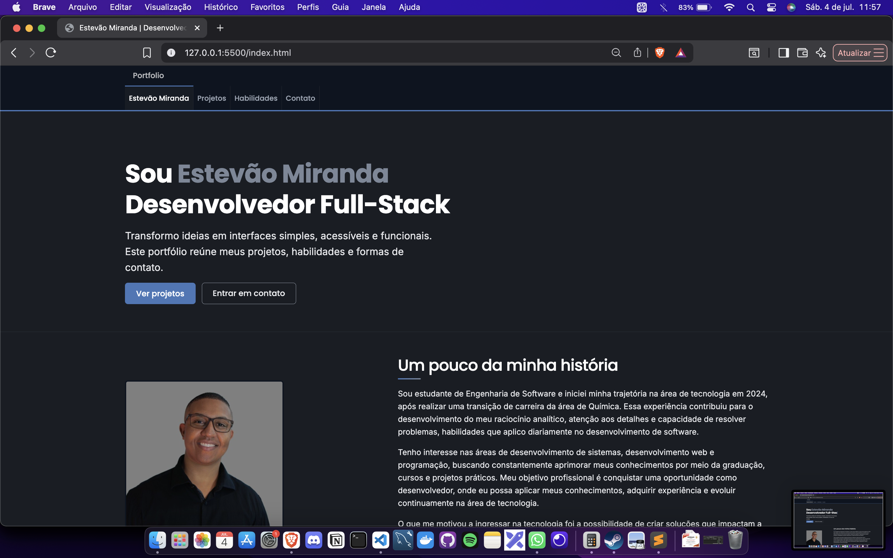
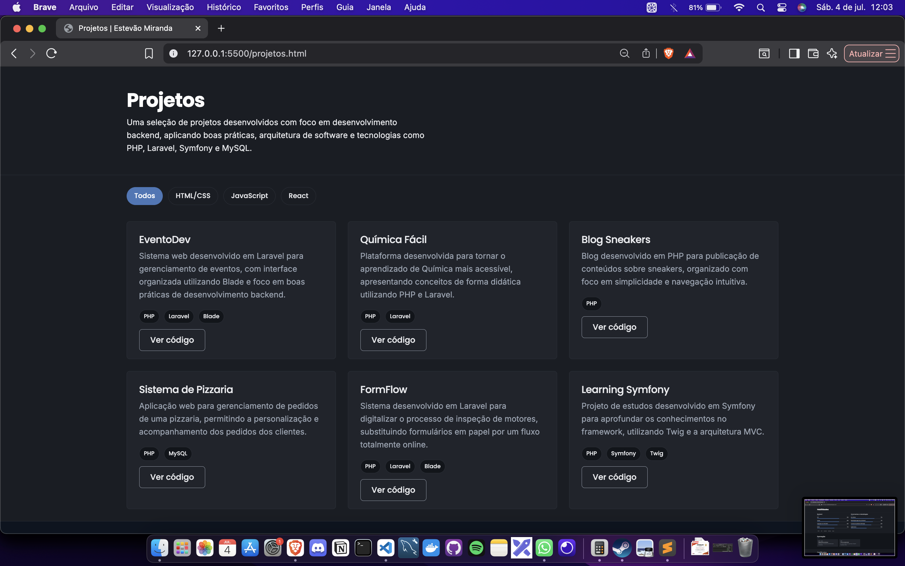
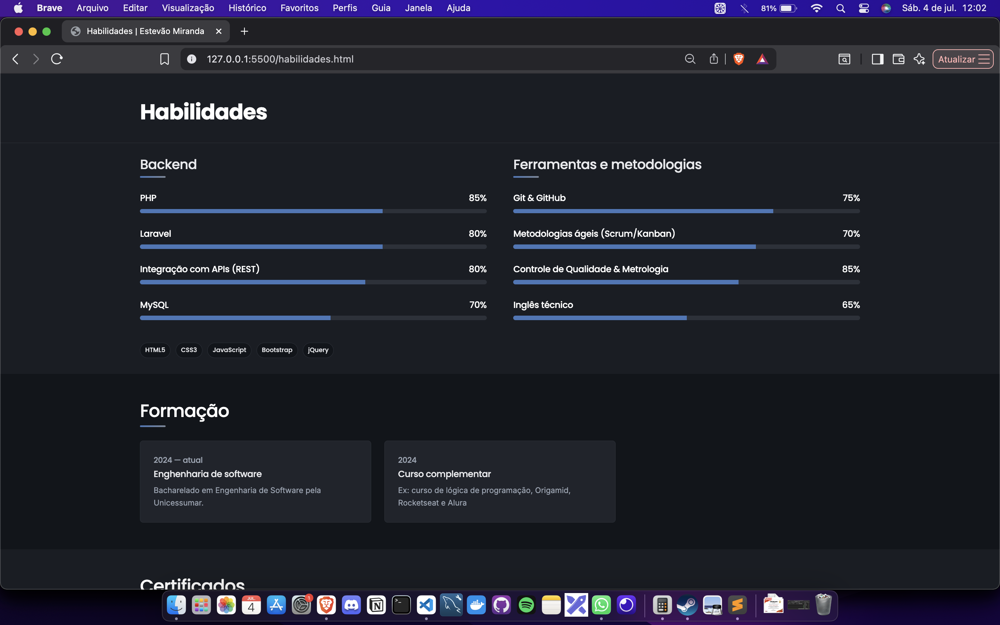
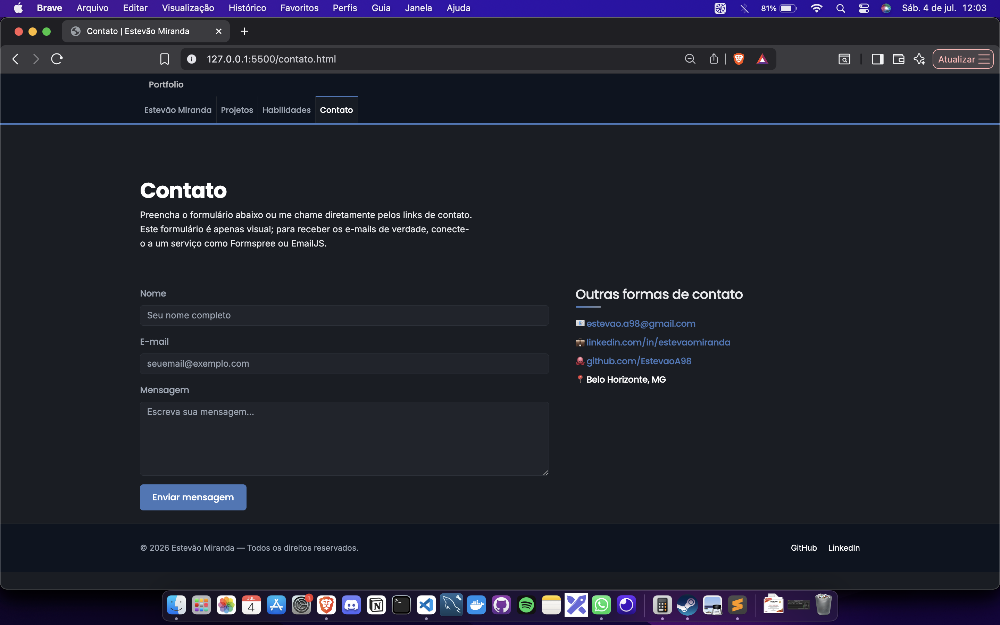

# Relatório do Projeto — Portfólio Pessoal

**Nome:** Seu Nome
**Disciplina:** Desenvolvimento Front-End
**Projeto:** Website de portfólio pessoal (HTML, CSS, JavaScript, jQuery e Bootstrap)

---

## 1. O que eu me propus a fazer

Para essa atividade, decidi criar o meu próprio portfólio pessoal, já que é
algo que eu realmente vou usar depois, para me apresentar e mostrar meus
projetos. Fiz um site com 4 páginas (Início, Projetos, Habilidades e
Contato), todas ligadas pelo mesmo menu, responsivo e com alguns efeitos em
JavaScript/jQuery para deixar a navegação mais interessante.

## 2. Como organizei o projeto

Separei tudo por responsabilidade, para o código ficar mais limpo e fácil de
manter:

```
portfolio-jr/
├── index.html          → página inicial
├── projetos.html        → meus projetos
├── habilidades.html     → minhas habilidades e formação
├── contato.html         → formulário de contato
├── css/
│   └── style.css       → todo o CSS do site
├── js/
│   └── script.js        → todo o JavaScript/jQuery do site
├── vendor/
│   ├── bootstrap/        → Bootstrap salvo dentro do projeto
│   └── jquery/            → jQuery salvo dentro do projeto
├── assets/
│   └── foto-perfil.svg   → onde entra minha foto
├── robots.txt             → arquivo de SEO
├── sitemap.xml             → arquivo de SEO
└── RELATORIO.md             → este relatório
```

Não deixei nada de CSS ou JavaScript misturado dentro do HTML — nenhuma tag
`<style>` nem atributo `style=""` solto no meio do código. Tudo que é
aparência está no `estilo.css`, e tudo que é comportamento/interação está no
`script.js`. Isso deixa cada arquivo com uma responsabilidade só, o que
facilita muito se eu precisar mudar alguma cor ou corrigir algum efeito
depois.

## 3. As decisões de design que tomei

Pensei em fugir um pouco do "portfólio genérico" e criei o menu do site
imitando as abas de um editor de código, tipo VS Code — e usei justamente os
nomes reais dos arquivos (`index.html`, `projetos.html`...) como itens do
menu. Achei que fazia sentido, já que é um portfólio de desenvolvedor.

Escolhi uma paleta com fundo claro, um verde (`#3e7c59`) como cor principal
dos botões e links, e um tom terracota (`#b24b2c`) para destacar pontos
específicos, como meu nome no topo. Para as fontes, usei `JetBrains Mono`
(fonte usada em editores de código) nos títulos, e `Inter` no texto corrido,
para manter uma boa leitura.

Também acrescentei alguns detalhes de estilização a mais:
- Uma linha decorativa colorida embaixo de cada título de seção (`h2::after` no CSS).
- Um efeito de "clique" nos botões principais (o botão afunda 1px ao ser pressionado).
- Um spinner de carregamento que aparece no botão de contato enquanto o e-mail está sendo enviado.

## 4. Como ficaram a estrutura e os efeitos de JavaScript/jQuery

Usei jQuery para todos os efeitos interativos do site, entre eles:

1. **Efeito de digitação** no título da página inicial (o texto abaixo do
   meu nome vai "digitando" e apagando algumas frases).
2. **Menu ativo automático** — o link da página que estou vendo fica
   destacado sozinho, comparando a URL atual com o `href` de cada link.
3. **Fade-in ao rolar a página** — os blocos de conteúdo aparecem suavemente
   conforme vou descendo a página (usei a classe `.revelar` para isso).
4. **Barras de habilidade animadas** — na página de habilidades, as barras
   de progresso só "enchem" quando essa seção entra na tela.
5. **Filtro de projetos por tecnologia** — na página de projetos, dá pra
   clicar em "HTML/CSS", "JavaScript" ou "React" e a lista filtra na hora.
6. **Validação e envio do formulário de contato** (detalhes na próxima
   seção).
7. **Botão de "voltar ao topo"** que só aparece depois que rolo um pouco a
   página.

Todas as variáveis do `script.js` foram escritas em português
(`paginaAtual`, `campoNome`, `campoEmail`, `botaoEnviar`, etc.), para o
código ficar mais fácil de entender.

## 5. Formulário de contato: validação e envio de e-mail de verdade

Esse foi o ponto que mais me exigiu pesquisa. Como o site é só front-end
(sem um servidor meu para receber os dados), usei o **EmailJS**, um serviço
gratuito que permite mandar e-mail direto pelo JavaScript do navegador, sem
precisar programar um back-end.

O funcionamento ficou assim:

1. Quando clico em "Enviar mensagem", o JavaScript primeiro **valida os
   campos**: confere se nome, e-mail e mensagem não estão vazios, e usa uma
   expressão regular (`regexEmail`) para checar se o e-mail digitado tem um
   formato válido.
2. Se algum campo estiver errado, aparece uma mensagem vermelha explicando
   o problema, sem nem tentar enviar nada.
3. Se estiver tudo certo, o botão mostra um **spinner de carregamento** e o
   texto "Enviando...", e o JavaScript chama `emailjs.send(...)` para
   realmente disparar o e-mail.
4. Quando o EmailJS confirma o envio, aparece uma mensagem verde de
   sucesso e o formulário é limpo. Se der erro (por exemplo, sem internet),
   aparece uma mensagem vermelha pedindo para tentar de novo.

Para essa parte funcionar de verdade, é preciso configurar uma conta grátis
no [EmailJS](https://www.emailjs.com/) e colocar três informações no topo do
arquivo `js/script.js`:

```js
var chavePublicaEmailJS = "SUA_CHAVE_PUBLICA_AQUI"; // Account > General > Public Key
var idServicoEmailJS   = "SEU_SERVICO_AQUI";        // Email Services
var idTemplateEmailJS  = "SEU_TEMPLATE_AQUI";       // Email Templates
```

No template criado dentro do EmailJS, uso três variáveis que já mando pelo
código: `nome_remetente`, `email_remetente` e `mensagem`. Enquanto eu não
configurar essas chaves, o site avisa (com uma mensagem de erro amigável) que
o envio de e-mail ainda não foi configurado, em vez de simplesmente falhar
sem explicação.

## 6. Responsividade

Usei o sistema de colunas do Bootstrap (`col-md-*`, `col-lg-*`) junto com
`@media` no meu próprio CSS, para o site se adaptar em três faixas de tela:
até 992px (tablets), até 768px e até 576px (celulares). Nessas larguras
menores, eu:
- Troco o menu para o formato "sanduíche" (collapse do Bootstrap);
- Reduzo o tamanho da fonte do título principal;
- Deixo os botões ocupando 100% da largura, para ficar mais fácil de tocar
  no celular.

Testei redimensionando a janela do navegador e também pelo modo de
simulação de dispositivos do Chrome (F12 → ícone de celular).

## 7. Capturas de tela do resultado final

As imagens abaixo estão na pasta `capturas/` deste projeto e mostram o
resultado final de cada página:

- `capturas/index-desktop.png` — página inicial (desktop)
- `capturas/index-mobile.png` — página inicial em tela de celular (375px), mostrando a responsividade
- `capturas/projetos-desktop.png` — página de projetos, com os filtros por tecnologia
- `capturas/habilidades-desktop.png` — página de habilidades, com as barras já animadas
- `capturas/contato-desktop.png` — página de contato, com o formulário







*(Essas capturas foram tiradas direto do código do próprio projeto. Depois
de escolher onde hospedar o site, pretendo tirar novas capturas pelo
navegador — com as fontes do Google carregando normalmente pela internet —
para deixar ainda mais fiel ao resultado online.)*

## 8. Por que usei Bootstrap e jQuery, e por que guardei eles dentro do projeto

Usei o Bootstrap para não precisar reescrever do zero coisas como o grid
responsivo e o menu que vira "sanduíche" no celular. O jQuery deixou mais
simples escrever os efeitos de interface (selecionar elementos, animar,
tratar eventos) do que em JavaScript puro.

Em vez de deixar o site inteiro dependendo só do CDN (os links externos tipo
`cdn.jsdelivr.net`), eu baixei o Bootstrap e o jQuery e coloquei dentro da
pasta `vendor/` do próprio projeto. Assim, se algum desses serviços externos
cair ou for bloqueado, meu site continua funcionando normalmente.

## 9. Desafios que enfrentei

- **Fazer as barras de habilidade animarem só quando aparecem na tela** — no
  começo elas simplesmente já apareciam cheias assim que a página carregava.
  Resolvi comparando a posição da seção com a posição da rolagem da página.
- **Configurar o envio de e-mail sem um back-end** — pesquisei algumas
  opções (Formspree, EmailJS) e escolhi o EmailJS por ter uma integração
  simples direto com jQuery/JavaScript.
- **Manter o menu funcionando igual em todas as páginas** — como não usei
  nenhum framework que monta os componentes automaticamente, tive que
  repetir o mesmo HTML do menu nas 4 páginas com cuidado para não haver
  divergência entre elas.
- **Separar completamente CSS/JS do HTML** — revisei o projeto e tirei todo
  estilo que tinha ficado solto como atributo `style=""`, movendo tudo para
  classes no `estilo.css`.

## 10. Como isso se conecta com o que aprendi na disciplina

- Estrutura semântica em HTML5 (`header`, `nav`, `section`, `footer`).
- CSS responsivo com variáveis (`:root`) e `media queries`.
- Manipulação do DOM e eventos com jQuery.
- Validação de formulário e expressões regulares em JavaScript.
- Consumo de um serviço externo (EmailJS) via JavaScript assíncrono
  (`.then()`, `.catch()`, `.finally()`).
- Boas práticas de organização de código (separação de responsabilidades,
  nomes de variáveis claros, comentários explicando cada trecho).

## 11. O que falta eu preencher com as minhas informações

- Meu nome, foto, e-mail e redes sociais (estão marcados como "Seu Nome" /
  "seuemail@exemplo.com" em todas as páginas).
- Meus projetos reais na página `projetos.html`, com links de GitHub/demo.
- Meu nível real em cada tecnologia, na página `habilidades.html`
  (atributo `data-nivel`).
- As três chaves do EmailJS, no topo do `js/script.js`.
- A URL final do site (depois do deploy), nos arquivos `robots.txt`,
  `sitemap.xml` e nas tags `canonical`/`og:url` de cada página.

## 12. Como entreguei e testei o projeto

Como o site é 100% estático (HTML, CSS e JavaScript puro, sem nenhum passo
de build), não preciso de nenhuma configuração especial de hospedagem — ele
funciona em qualquer serviço de hospedagem de arquivos estáticos, ou até
localmente.

Para testar antes de entregar, abri o `index.html` direto no navegador e
naveguei pelas 4 páginas pelo menu. Também simulei diferentes tamanhos de
tela pelo modo de dispositivo do navegador (F12 → ícone de celular) para
conferir a responsividade.

Para entregar, compactei a pasta inteira do projeto (`portfolio-jr`) em um
arquivo `.zip`, junto com este relatório.
